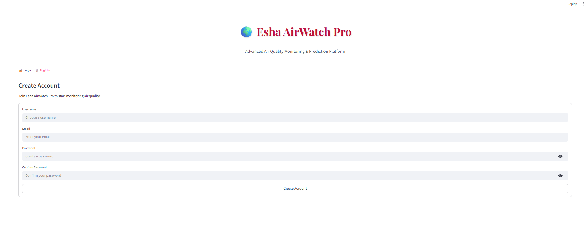
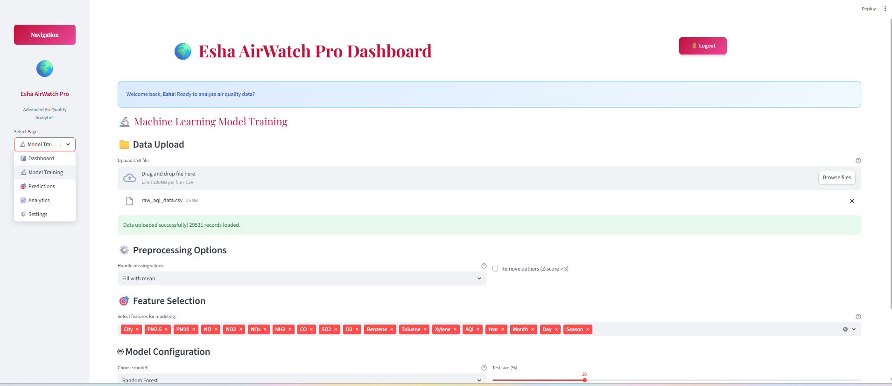
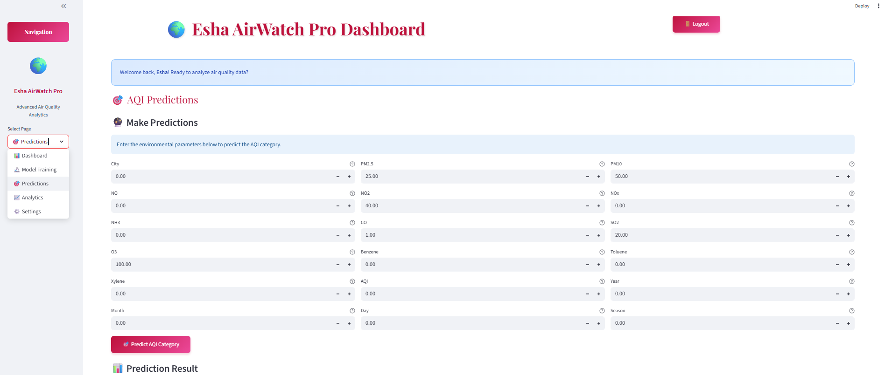
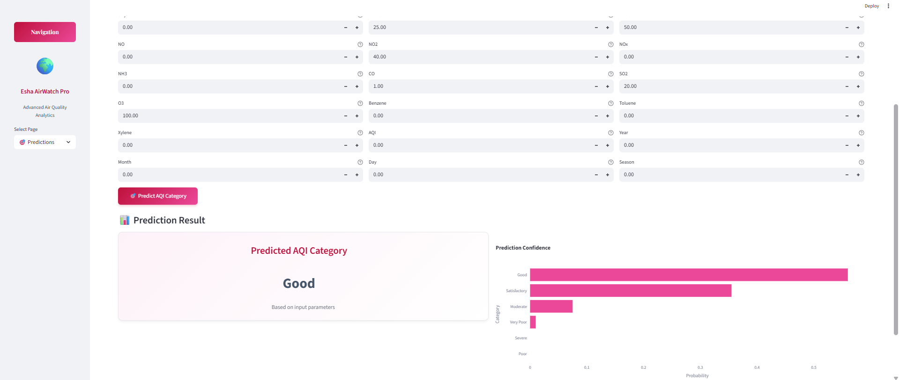

<div align="center">
  <h1 style="font-size:2.5rem; margin-bottom:0;">Esha AirWatch Pro 🌍</h1>
  <p style="font-size:1.2rem; margin-top:0;">
    <b>🌫️ Advanced Air Quality Monitoring, Machine Learning Prediction & Interactive Visualization</b>
  </p>
  <p>
    <a href="https://streamlit.io/" target="_blank"></a>
    <a href="https://www.python.org/" target="_blank"></a>
    
    
  </p>
</div>

<p align="center" style="font-size:1.1rem;">
  <b>✨ A modern AI-powered web app for exploring, modeling, and predicting Air Quality Index (AQI). ✨</b>
</p>

### ✨ Overview

Esha AirWatch Pro is an interactive Streamlit web app designed to monitor, analyze, and predict Air Quality Index (AQI) using machine learning models.
It combines data visualization, AI-driven predictions, and a modern UI with login authentication for personalized access.

### 🚀 Features

- 🔑 User Authentication – Secure login and registration system
- 📂 Data Upload – Upload CSV files containing air quality data
- 📊 Interactive Dashboard – Explore pollutant distributions & correlations
- 🤖 Model Training – Train ML models (Random Forest, Logistic Regression, XGBoost)
- 🏆 Model Evaluation – View Classification Report, Confusion Matrix, Feature Importance
- 🔮 Live Predictions – Enter pollutant levels and predict AQI category instantly
- 🎨 Modern UI – Clean, responsive, and user-friendly interface

### 📸 App Preview  

#### Login Page  


#### Dashboard Page  


#### Prediction Page


#### Graph Page  



### Setup and Run the Streamlit App

```bash
# 1. Create and activate a virtual environment
python -m venv .venv
.venv\Scripts\activate  # Windows
source .venv/bin/activate  # Mac/Linux

# 2. Install dependencies
pip install -r requirements.txt

# 3. Run the Streamlit app
streamlit run app.py

```

### 🧑‍💻 Usage

1. Login/Register – Securely log in to access the dashboard
2. Upload Data – Load CSV files containing AQI-related pollutant values
3. Preprocess & Train – Handle missing values, select features, and train models
4. Evaluate – Check classification report, confusion matrix, and feature importance
5. Predict – Input pollutant levels to predict AQI category in real-time

### 📂 Project Structure

Esha AirWatch Pro/

├── app.py                # Main Streamlit app

├── requirements.txt      # Dependencies

├── data/                 # Sample datasets

├── models/               # Saved trained models (aqi_model.pkl)

├── screenshots/          # UI screenshots

└── tests/                # Unit tests


### 🛠️ Tech Stack

- **Frontend/UI:** Streamlit, Tailwind-inspired design, modern React-style login  
- **Backend/ML:** Python, Scikit-learn, XGBoost, Pandas, Numpy  
- **Visualization:** Plotly, Matplotlib, Seaborn  
- **Authentication:** JSON-based login system  
- **Deployment:** Streamlit Cloud / Localhost


## 👤 Author

Esha Sachin Potdar

<a href="https://github.com/EshaPotdar18" target="_blank">GitHub: @EshaPotdar18</a>

#### 📄 License

This project is licensed under the MIT License – see the LICENSE file.

<div align="center">  <h3>Made with ❤️ by Esha Potdar</h3> </div>
